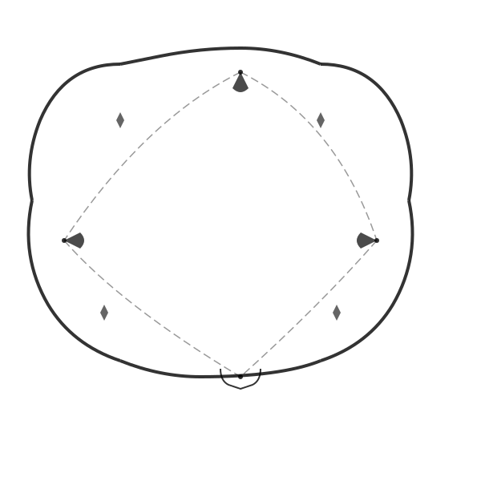

# Lao Shifu Fractal Frame Customization Guide

## Overview

The Lao Shifu logo section features a beautiful, organic fractal curved frame that replaces the previous square frame design. This guide explains how to customize the frame's appearance and behavior.

## CSS Variables for Customization

All frame styling is controlled through CSS custom properties defined in the `:root` section. You can customize these values to adjust the frame's appearance:

### Frame Colors and Styling

```css
/* In the :root section of index.html */
--logo-frame-color: #06566d;        /* Primary frame color (teal blue) */
--logo-frame-accent: #e2aa42;       /* Accent color for highlights (golden) */
--logo-frame-stroke: 4px;           /* Stroke width of frame lines */
--logo-frame-opacity: 0.9;          /* Overall frame opacity (0-1) */
```

### Halo Effect (Background Glow)

```css
--logo-halo-opacity: 0.15;          /* Halo visibility (0-1) */
--logo-halo-size: 400px;            /* Halo diameter */
--logo-halo-blur: 80px;             /* Blur intensity */
```

## Frame Variants

Two SVG frame variants are included:

### 1. Multi-Color Gradient Frame (Default)
**File:** `laoshifu-frame-fractal.svg`

- Features animated color gradients matching the site palette
- Includes teal (#06566d), warm brown (#7a3013), and golden (#e2aa42) tones
- Automatically animates between colors for a dynamic effect

### 2. Monochrome Themeable Frame
**File:** `laoshifu-frame-mono.svg`

- Uses `currentColor` for easy CSS theming
- Single-color variant that inherits from `--logo-frame-color`
- Lighter weight and simpler appearance

To switch to the monochrome variant, edit `index.html`:

```html
<!-- Change from: -->


<!-- To: -->

```

## Logo Asset Optimization

The logo now uses modern image formats for better performance:

### WebP with PNG Fallback

```html
<picture>
    <source srcset="logo.webp" type="image/webp">
    
</picture>
```

- **WebP version:** 93KB (37% smaller than PNG)
- **PNG fallback:** 148KB (for older browsers)
- Proper dimensions specified to prevent CLS (Cumulative Layout Shift)

### Replacing the Logo Asset

To update the logo image:

1. Create optimized versions:
   ```bash
   # Convert to WebP with high quality
   cwebp -q 90 -m 6 your-logo.png -o logo.webp
   
   # Or keep PNG as fallback
   cp your-logo.png logo.png
   ```

2. Ensure dimensions are 640x640 pixels or update the HTML width/height attributes accordingly

## Animation Customization

### Frame Rotation Speed

The frame slowly rotates for a subtle motion effect. Adjust the speed by modifying the animation duration:

```css
@keyframes frameRotateSlow {
    from { transform: translate(-50%, -50%) rotate(0deg); }
    to { transform: translate(-50%, -50%) rotate(360deg); }
}

.laoshi-frame {
    animation: frameRotateSlow 80s linear infinite; /* Change 80s to adjust speed */
}
```

### Logo Float Animation

The logo gently floats up and down. Adjust the animation:

```css
@keyframes logoFloat {
    0%, 100% { transform: translateY(0px); }
    50% { transform: translateY(-15px); } /* Change -15px for more/less movement */
}

.laoshi-logo {
    animation: logoFloat 6s ease-in-out infinite; /* Change 6s for speed */
}
```

### Disable Animations (Accessibility)

Animations automatically disable for users who prefer reduced motion:

```css
@media (prefers-reduced-motion: reduce) {
    .laoshi-frame,
    .laoshi-halo,
    .laoshi-logo {
        animation: none;
    }
}
```

## Responsive Breakpoints

The frame automatically adjusts at different screen sizes:

| Breakpoint | Frame Size | Logo Size |
|------------|------------|-----------|
| Desktop (>768px) | 600px × 600px | 380px |
| Tablet (≤768px) | 400px × 400px | 260px |
| Mobile (≤480px) | 320px × 320px | 200px |
| Small (≤375px) | 280px × 280px | 180px |

### Customizing Breakpoints

Edit the media queries in the CSS section:

```css
@media (max-width: 768px) {
    .laoshi-frame {
        width: 400px;  /* Adjust frame size */
        height: 400px;
    }
    .laoshi-logo {
        width: 260px;  /* Adjust logo size */
    }
}
```

## Performance Considerations

The implementation follows performance best practices:

### GPU-Accelerated Animations
- Only `transform` and `opacity` properties are animated
- No expensive properties like `filter: blur()` on large surfaces
- `will-change` hints optimize rendering

### Lightweight Assets
- SVG frame: ~10KB (compressed)
- WebP logo: 93KB vs 148KB PNG (37% reduction)
- No external dependencies

### CSS Containment
```css
.laoshi-centerpiece {
    contain: layout style paint; /* Isolates rendering */
}
```

## Accessibility Features

### Keyboard Navigation
- Logo link has visible focus state with golden outline
- Focus offset for better visibility

### Screen Readers
- Frame SVG marked with `aria-hidden="true"` (decorative only)
- Logo has proper alt text: "Lǎo Shīfu - SupraSaiyans"

### Motion Sensitivity
- Respects `prefers-reduced-motion` user preference
- Disables all animations when requested

## Advanced Theming

To integrate with a future theme system, the frame can be styled via CSS variables:

```css
[data-theme="light"] {
    --logo-frame-color: #115362;
    --logo-frame-accent: #d4971e;
    --logo-frame-opacity: 0.8;
    --logo-halo-opacity: 0.1;
}

[data-theme="dark"] {
    --logo-frame-color: #06566d;
    --logo-frame-accent: #e2aa42;
    --logo-frame-opacity: 1;
    --logo-halo-opacity: 0.15;
}
```

## Troubleshooting

### Frame Not Visible
- Check that `laoshifu-frame-fractal.svg` is in the root directory
- Verify `--logo-frame-opacity` is not set to 0
- Ensure browser supports SVG

### Performance Issues
- Reduce frame size on lower-end devices
- Lower `--logo-halo-blur` value
- Consider using monochrome variant (lighter weight)

### Animation Stuttering
- Check that `will-change` is properly set
- Verify no other heavy animations are running simultaneously
- Ensure GPU acceleration is working (check DevTools Performance)

## Examples

### High Contrast Mode
```css
--logo-frame-color: #ffffff;
--logo-frame-accent: #ffd700;
--logo-frame-opacity: 1;
--logo-halo-opacity: 0.25;
```

### Minimal Mode
```css
--logo-frame-stroke: 2px;
--logo-frame-opacity: 0.5;
--logo-halo-opacity: 0.05;
--logo-halo-blur: 40px;
```

### Vibrant Mode
```css
--logo-frame-color: #0a7ea4;
--logo-frame-accent: #ff6b35;
--logo-frame-opacity: 1;
--logo-halo-opacity: 0.3;
```

## Credits

Frame design inspired by fractal art and organic growth patterns, complementing the existing globe/fractal background motif of the SupraSaiyans landing page.
